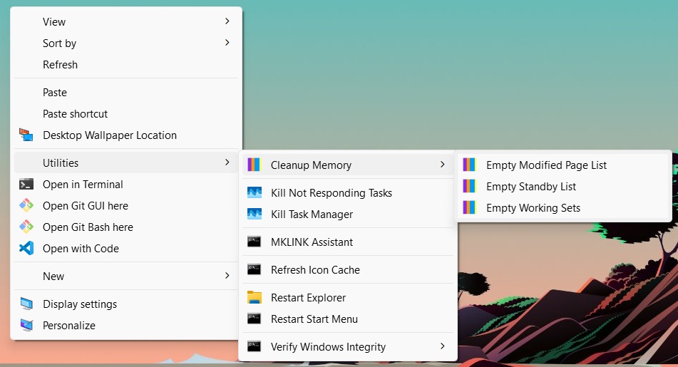

## Utilities Menu for Windows 11 Desktop Context Menu
A simple set of utilities added to the Windows 11 desktop context menu for quick access to common tasks.

## Features

- **Kill Not Responding Tasks**: Finds and kills all non-responding tasks
- **Kill Task Manager**: Forcibly closes the Task Manager process to resolve issues
- **Restart Explorer**: Restarts Windows Explorer to resolve various UI issues
- **Restart Start Menu**: Restarts the Start Menu to resolve various UI issues
- **Verify Windows Integrity**: Verify and repair system files using the System File Checker (SFC) tool and Deployment Imaging Service and Management Tool (DISM)

## Optional Addons

- **Restart Explorer7**: Optional feature for explorer7 users to restart explorer 7 without needing the log off. *(Requires explorer7 to be installed into `C:\Utilities\explorer7`.)*
- **Refresh Icon Cache**: Refreshes the icon and thumbnail cache to fix icon display issues.
- **Cleanup Memory**: Free up memory with by clearing the Working Sets, Standby List, and Modified Page List with the RAMMap Memory Cleanup Script.
- **Inspect Target**: Inspect a specified target with UWPSpy. *(Requires UWPSpy to be installed to `C:\Utilities\UWPSpy`.)*
- **Classic Personlization**: Add Classic Personlization to the desktop context menu.
- **Control Panel**: Add Control Panel to the desktop context menu.

## Instructions

1. Download the ZIP file from the link below.
2. Extract the contents of the ZIP file to a folder of your choice.
3. Copy the `Utilities` folder to the root of your `C:` drive `(C:\Utilities)`.
4. Double-click the `Add Utilities Menu.reg` file to add the Utilities Menu to your desktop context menu.

To remove the Utilities Menu from your desktop context menu, double-click the `Remove Utilities Menu.reg` file.

## Addon Instructions

### Explorer7

- Download explorer7 from the official [releases](https://github.com/world-windows-federation/explorer7/releases) page and extract the source files into `C:\Utilities\explorer7`. Then follow the instructions to set it up on your system. *(A windows 7 or xp iso file is required for explorer7. You can find an AIO Windows 7 ISO on [archive.org](https://archive.org/details/windows-7-all-in-one-iso-with-all-languages))*.

If done correctly, the file structure should look like this:

- **Enable Modern Apps**: Double-click the `Enable Modern Apps.reg` file included in the `explorer7\extra` directory to enable support for modern apps in explorer7.
- **AcrylicColorization**: Double-click the registry file for your desired setting in the `explorer7\extras\AcrylicColorization` directory.
- **ColorizationOptions**: Double-click the registry file for your desired setting in the `explorer7\extras\ColorizationOptions` directory.
- **Themes**: Double-click the `aero.reg` file located in the `explorer7\extras\Themes` directory to enable to aero theme. *(Alternatively, if you know how to work with registry files, you can use the `aero.reg` file as a template to make a registry file for your own themes)*

### Cleanup Memory

1. Download and install [Sysinternals Suite](https://apps.microsoft.com/detail/9p7knl5rwt25) from the Microsoft Store.
2. Double-click the `Add Cleanup Memory.reg` file located in the `Utilities\Addons` directory.

To remove, simply double-click the `Remove Cleanup Memory.reg` file located in the `Utilities\Addons` directory.

### Refresh Icon Cache

1. Double-click the `Add Refresh Icon Cache.reg` file located in the `Utilities\Addons` directory.

To remove, simply double-click the `Remove Refresh Icon Cache.reg` file located in the `Utilities\Addons` directory.

### UWPSpy

1. Download UWPSy from [ramensoftware.com/uwpspy](https://ramensoftware.com/uwpspy) and extract it's contents into `C:\Utilities\UWPSpy`
2. Add the `C:\Utilities\UWPSpy` directory to path via `setx /M PATH "%PATH%;C:\Utilities\UWPSpy"`.
3. Double-click the `Add UWPSpy.reg` file loccated in the `Utilities\Addons` dirtectory.

To remove, simply double-click the `Remove UWPSpy.reg` file located in the `Utilities\Addons` directory.

- The `Inspect Target` entree will allow users to open UWPSpy directly to the specified target, simply click it and enter the desired target intot he cmd prompt window that opens.
- The `Light Mode` entree will force UWPSPy to open in Windows Light mode.
- The `Dark Mode` entree will force UWPSpy to open in Windows Dark mode

---

**Download**: [Download ZIP](https://github.com/The-Back-Room/Utilities-Menu-for-Windows-11-Desktop-Context-Menu/archive/refs/heads/main.zip)
